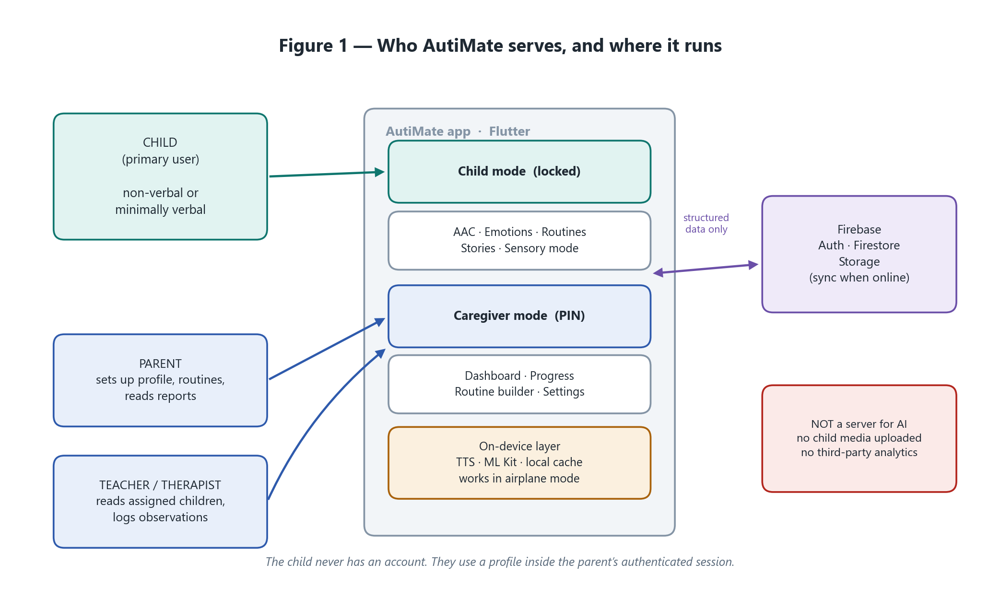
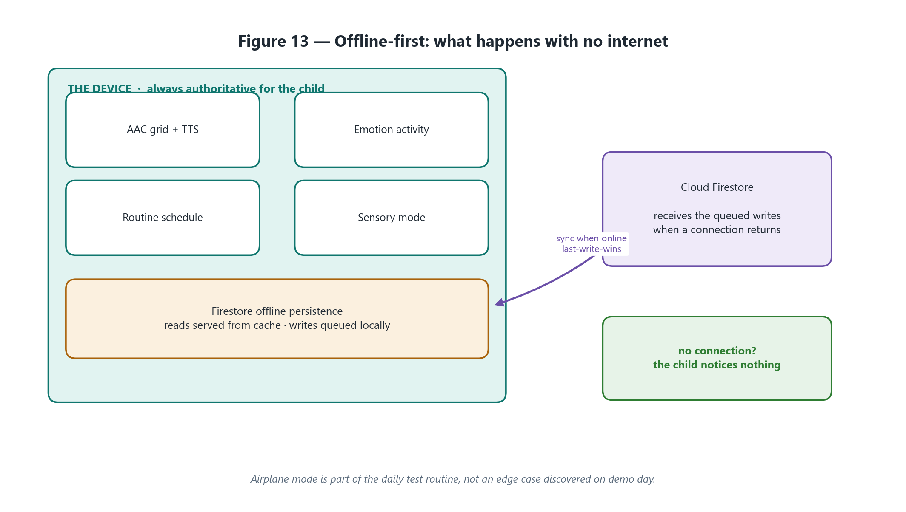
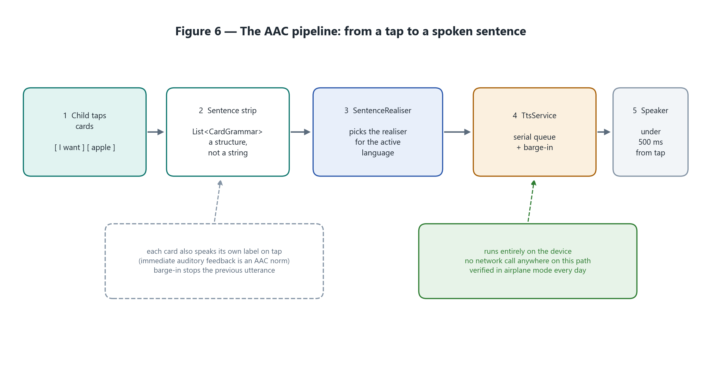
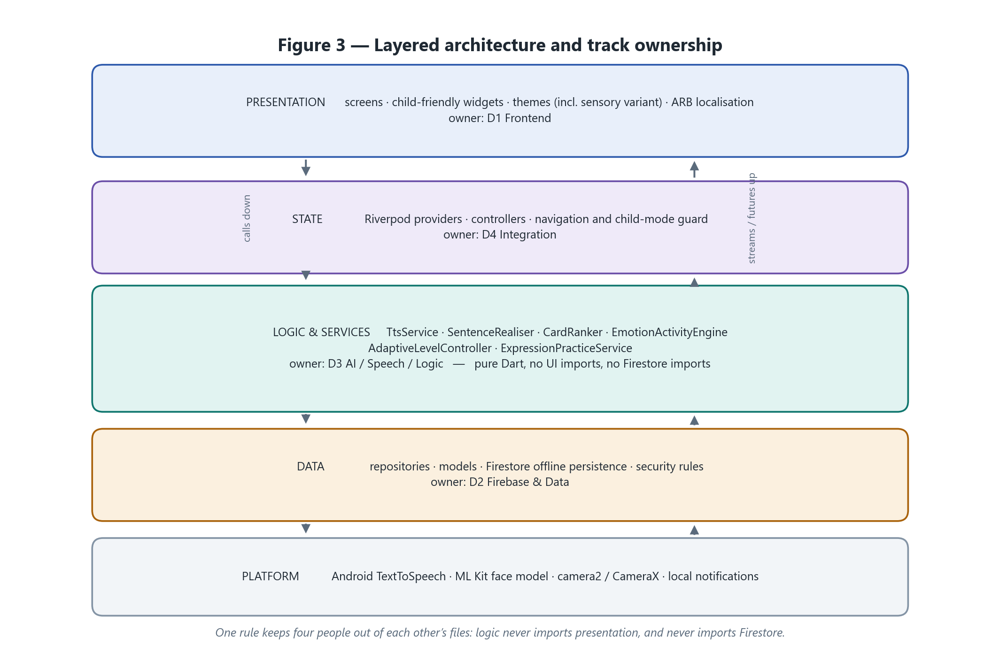

<div align="center">

# AutiMate

### An offline-first, bilingual communication and learning companion for autistic children

**Competition submission — a complete, runnable Flutter application, not a prototype.**

[](https://flutter.dev)
[](https://dart.dev)
[](#quality-evidence)
[](#quality-evidence)
[](#quality-evidence)
[](#2-bilingual-by-construction)
[](#1-offline-first-is-a-guarantee-not-a-fallback)

</div>

---

## The problem

A child who cannot speak still has everything to say.

Augmentative and Alternative Communication (AAC) is the established answer, and for most families in our region it is out of reach. Dedicated AAC devices cost more than a month of household income. The good software is subscription-priced, English-only, and assumes a stable internet connection. What remains are picture boards that cannot speak, and apps whose "AI" is a black box a parent is asked to trust with their child.

Three gaps follow from that, and AutiMate is built to close all three:

| Gap | What it means in practice |
|---|---|
| **Language** | Urdu-speaking children are handed an English board. A child's first words should not be in a language their family does not use at home. |
| **Connectivity** | A load-shedding evening, a school with no Wi-Fi, a family on prepaid data. A communication aid that needs a network is not a communication aid. |
| **Trust** | Caregivers are given scores and predictions with no account of where they came from. Nobody can act on a number they cannot interrogate. |

**AutiMate is not a diagnostic, screening, or treatment application, and it makes no clinical claims.** It is a support tool for communication, emotion learning, predictable routines, sensory regulation, and explainable progress tracking.

---

## What we built

A production-grade Flutter application — **101 source files, roughly 25,800 lines of Dart, 504 passing tests** — covering the complete child and caregiver experience, with every screen working on a device in aeroplane mode.

<div align="center">



</div>

### The child's side

| Feature | What it does |
|---|---|
| **AAC board** | 31 core vocabulary cards across 8 categories, Fitzgerald-key colour coding, a drag-to-reorder sentence strip, and grammatical sentence realisation in both languages before the sentence is spoken aloud. |
| **Custom cards** | A caregiver adds the child's own people, foods, and places with a gallery or camera photo, and can record their own voice for the card — a parent's real voice motivates more than synthesis, and it sidesteps weak Urdu TTS on low-end devices. |
| **Emotion practice** | Six emotions drawn in code as a parameterised face painter — no image assets to mismatch a child's skin tone or expression — with adaptive difficulty, a five-point intensity scale, and stars. |
| **Expression practice** | The child mirrors a face; on-device ML Kit reads the frame and gives feedback. Frames are analysed in memory and discarded. |
| **Routines** | A visual timeline with a countdown, spoken transition warnings, a waiting board, and flexibility training for when the plan changes. |
| **Social stories and conversation** | Authored, bilingual, fixed-branching scripts. Fitting replies advance; unexpected replies stay on the same step so the child can try again. There is no failure state. |
| **Interest-based learning** | A deterministic interest-to-topic mapping, so a child fascinated by trains learns counting with trains. |
| **Sensory support** | Sensory mode (desaturated, motion-suppressed, shadow-free), a dark theme, guided breathing with a longer exhale than inhale, and three generated calming ambient loops under a volume ceiling. |
| **Gamification** | Stars, four badges, streaks, and a progress ring — cooperative throughout. **There is no leaderboard anywhere in the app, by policy.** |

### The caregiver's side

A PIN-gated dashboard with weekly activity aggregation, an emotion-accuracy trend, an achievements timeline, and observation logging — every figure computed from recorded sessions by a pure, unit-tested aggregator. Alongside it: a printable PDF of the AAC board, an Android home-screen quick-phrase widget, full profile backup and restore, and per-child support-level and literacy-ladder controls.

---

## What makes it different

These are the five decisions we would defend in front of a judge.

### 1. Offline-first is a guarantee, not a fallback

Every child-facing feature runs with no network, no account, and no credentials. Firebase is a **synchronisation layer bolted on top of local repositories, never a dependency underneath them**. `main.dart` attempts initialisation and treats failure as explicitly non-fatal, because — in the words of the comment that sits there —

> a misconfigured backend can never cost a child the app.

Writes made offline land in a durable `OfflineSyncQueue` and drain idempotently on reconnect, resolved last-write-wins on logical event time.

<div align="center">



</div>

### 2. Bilingual by construction

Not a translation layer bolted on late. **Around 410 strings in both English and Urdu**, full RTL layout, and **Noto Nastaliq Urdu bundled as a variable font**, because Nastaliq is the script Urdu readers expect and device coverage cannot be assumed. The typography system carries a separate line-height ramp for Nastaliq, which stacks its ligatures diagonally and needs far more vertical space than Latin.

The sentence realiser is genuinely bilingual rather than a word-swap: it handles English articles and countability, *and* Urdu gender agreement, inflecting the verb to the speaker's gender.

<div align="center">



</div>

### 3. Explainable AI, on purpose

Every adaptive behaviour in AutiMate is a **transparent rule a caregiver can be shown**, sitting behind an interface a trained model could implement tomorrow without changing a line upstream:

- **`RuleBasedAiEngine`** classifies expressions and returns a label, a confidence, *and a plain-language reason*. No model file, no download, no network — so there is no bias baked into weights nobody on the team can inspect.
- **`RuleBasedAdaptiveLevelController`** moves a child up a level after three consecutive successes and down after two failures, and a caregiver can lock or override it outright.
- **`WordPredictor`** suggests from grammar rules plus *this child's own usage history*, so a caregiver can be told exactly why a word was offered. It ships off by default, because a shifting row of suggestions breaks the motor memory a board is built on.

This trades raw capability for accountability. For this audience we think that is the right trade — and because the boundary is an interface, it is reversible.

### 4. Accessibility enforced by the test suite, not by intention

- **WCAG AA contrast is a unit test.** `theme_contrast_test.dart` implements the WCAG 2.1 relative-luminance formula and asserts 4.5:1 across the palette — including *after* sensory mode strips 40% of the saturation out.
- **No flashing, strobing, or luminance change above 3 Hz**, anywhere in the app.
- **Motion respects the operating system.** Every animation passes through one resolver that honours both the in-app sensory mode and the OS-level "remove animations" setting. Curves only decelerate; nothing overshoots or bounces, because anticipation and rebound read as unpredictable.
- **A two-tier type system.** Child surfaces get a 20 dp floor and a larger scale; caregiver surfaces get Material defaults. The visible size difference is itself a signal about who a screen is for.
- **Symbol size is user-controlled** across three scales, and the UI states the trade-off — bigger symbols mean fewer cards and more scrolling — so a caregiver chooses knowingly.
- **Colour is never the only channel.** Every accent is paired with an icon, a border, and a label, so a colour-blind child or a greyscale printout loses nothing.
- **16 committed golden images** lock the rendered output of the mascot, the emotion faces, the symbol tiles, and the progress ring, so a visual regression fails the suite instead of shipping.

### 5. Privacy is a design constraint, not a policy page

| Decision | Rationale |
|---|---|
| Camera frames never leave the device | Analysed in memory by on-device ML Kit and discarded. Nothing is recorded or uploaded. |
| Custom-card photos stay in app-private storage | Never uploaded, never synced. |
| The home-screen widget carries phrase labels only | No history, no card data, no child name — a widget is visible to anyone holding the device. |
| Emotion intensity is never aggregated | No average, no trend line. Those are exactly the artefacts that turn a communication aid into a surveillance record. |
| No open-ended generative chat, ever | Child-facing text is authored, reviewed, and fixed. |
| Service-account keys are gitignored by pattern | Not left to vigilance. |

---

## Architecture

Feature-first Flutter with strict layering. **One rule keeps the layers honest: logic never imports presentation, and never imports Firestore.** Every platform capability — TTS, camera, audio, files, printing — sits behind a domain interface with a test double, which is why 78.5% line coverage is reachable without a physical device.

<div align="center">



</div>

```
mobile/lib/
├── core/
│   ├── config/         compile-time configuration; safe defaults everywhere
│   ├── data/           local stores, offline sync queue, Firebase adapters, backup
│   ├── services/       TTS ladder, connectivity, app state
│   └── theme/          design tokens — colour, type, spacing, motion, depth
├── features/<name>/
│   ├── domain/         pure Dart. No Flutter imports, no Firestore imports.
│   ├── data/           platform adapters implementing the domain interfaces
│   └── presentation/   screens and widgets
├── shared/widgets/     the component library
└── l10n/               app_en.arb · app_ur.arb
```

Fourteen features: `ai`, `authentication`, `communication`, `emotion_recognition`, `gamification`, `home`, `learning`, `onboarding`, `parent_dashboard`, `progress`, `routines`, `sensory_support`, `settings`, `social_communication`.

All 18 design and planning figures live in [docs/diagrams/](docs/diagrams/).

### Tech stack

| Layer | Choice |
|---|---|
| Framework | Flutter 3.35.7 · Dart 3.9 |
| State | Riverpod |
| Local persistence | `shared_preferences` behind a `KeyValueStore` interface |
| Speech | `flutter_tts` behind a queued, locale-aware `TtsService` |
| On-device AI | `google_mlkit_face_detection` + `camera` |
| Backend (optional) | Firebase Auth · Cloud Firestore |
| Output | `pdf` / `printing` (paper board) · `home_widget` (quick phrases) · `share_plus` (backup) |
| Fonts | Lexend and Noto Nastaliq Urdu, bundled, SIL OFL 1.1 |

Every dependency in [mobile/pubspec.yaml](mobile/pubspec.yaml) carries a written justification for why it earns its place.

---

## Run it

```powershell
cd mobile
flutter pub get
flutter run
```

That is the whole setup. **No credentials, no account, no backend** — the app defaults to fully offline local repositories, which is also the demo mode.

Android is the primary target; iOS is best-effort.

### Verify our claims

```powershell
flutter analyze     # expect: No issues found!
flutter test        # expect: All tests passed! (504)
```

### Optional — enable cloud sync

Firebase is credentialed and the backend code is complete and tested. See [FIREBASE-SETUP.md](FIREBASE-SETUP.md). Two console actions remain — deploy the security rules, and enable the Email/Password provider — and until they happen the app runs offline exactly as it does now.

Configuration is injected at build time and never committed:

```powershell
flutter run --dart-define=AUTIMATE_FIREBASE_PROJECT_ID=your-project
```

Setting `AUTIMATE_ENVIRONMENT=mock` forces local-only even with real credentials present, which is useful for demoing on a venue's hostile Wi-Fi.

### Regenerating assets

```powershell
python tool/make_icon.py            # launcher icon + splash from the mascot
dart run flutter_launcher_icons
dart run flutter_native_splash:create
python tool/make_ambient_audio.py   # the three calming loops
flutter test --update-goldens test/golden_design_test.dart
```

Regenerate goldens deliberately and read the diff — a golden that changes without anyone intending it is the entire point of the file.

---

## Quality evidence

Everything below was measured on this commit, not estimated.

| Metric | Result |
|---|---|
| Tests | **504 passing**, 0 failing, across 41 test files |
| Line coverage | **78.5%** — 6,819 of 8,682 lines across 99 files |
| Static analysis | **`flutter analyze`: No issues found** |
| Golden images | 16 committed |
| Source | 101 files, roughly 25,800 lines of Dart |
| Test code | roughly 8,800 lines |
| Localisation | around 410 strings in 2 languages, full RTL |

The suite covers pure domain logic, widget behaviour, complete offline user journeys, WCAG contrast maths, layout-overflow audits, localisation, lifecycle and resource disposal, and the Firebase adapters against an in-memory Firestore — so the backend is genuinely tested without a live project or an emulator.

---

## Honest limitations

We would rather a judge hear this from us than find it themselves. **Three things are written but have never executed**, and we do not claim them as working:

1. **The Firestore security rules** have never been evaluated — the adapter tests use an in-memory Firestore that does not enforce rules. They are authored and ready to deploy.
2. **The ML Kit camera adapter** has never run against a real camera. It is covered by tests through a simulated expression service.
3. **The native side of the home-screen widget** has never been compiled.

Each needs a physical device or the full Android SDK to close. Cloud sync additionally awaits the two Firebase console actions noted above.

Beyond that: the printable-board and backup flows are tested at the logic layer, but their file-picker plumbing depends on the platform; iOS is best-effort; and Urdu TTS quality varies by device — which is exactly why the caregiver voice-recording feature exists, and why [tools/urdu_tts_probe/](tools/urdu_tts_probe/) is kept for checking offline Urdu voice availability on real hardware.

---

## Scope guardrails

Set at the start of the project and never relaxed:

- No open-ended child-facing generative chat.
- No clinical or behavioural diagnosis claims.
- Camera frames stay on-device and are discarded.
- Custom-card photos stay in app-private storage and are never uploaded.
- No flashing, strobing, or luminance change above 3 Hz.
- No competitive or ranked gamification.
- Child-facing P0 features must work offline and support English and Urdu with RTL.

---

## Team

Built by **Muhammad Hamza Habib** and **Mohsin Behzad**, across 111 commits at [github.com/hamzahabib2024/autimate](https://github.com/hamzahabib2024/autimate).

Fonts are Lexend and Noto Nastaliq Urdu, both SIL OFL 1.1, with licences bundled beside the binaries in [mobile/assets/fonts/](mobile/assets/fonts/).

---

<div align="center">

**AutiMate — because a child who cannot speak still has everything to say.**

</div>
